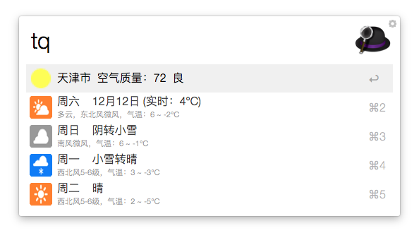
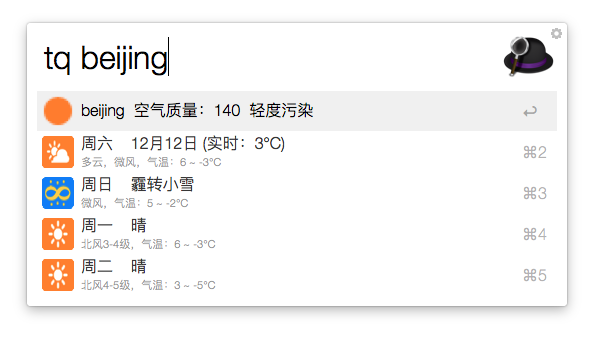

Weather-Query
=============
Alfred 2 workflow, 通过百度天气 API 查询天气以及 PM2.5 空气质量

[下载 workflow](https://github.com/Neon4o4/Weather-Query/releases/latest)

快捷键
-----
默认快捷键为`tq`

参数为可选参数，不指定参数时将根据当前 IP 定位并查询当地天气以及空气质量情况

参数可指定为要查询的城市（如：北京）或拼音（如：beijing）

License
-------
MIT